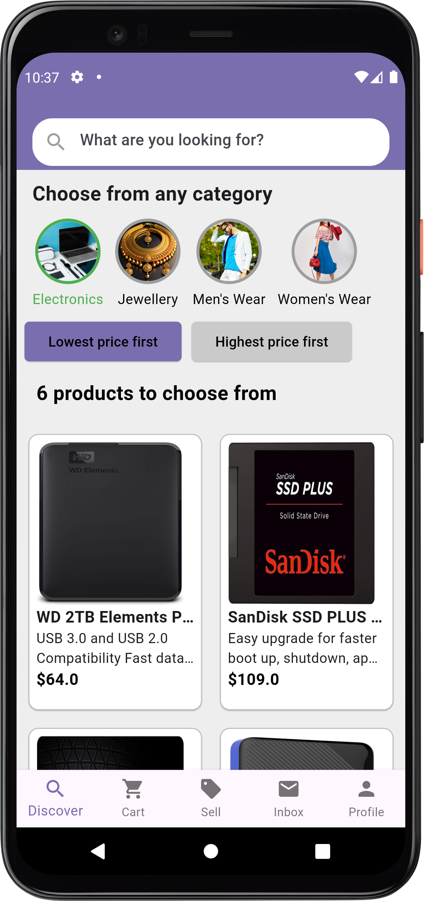
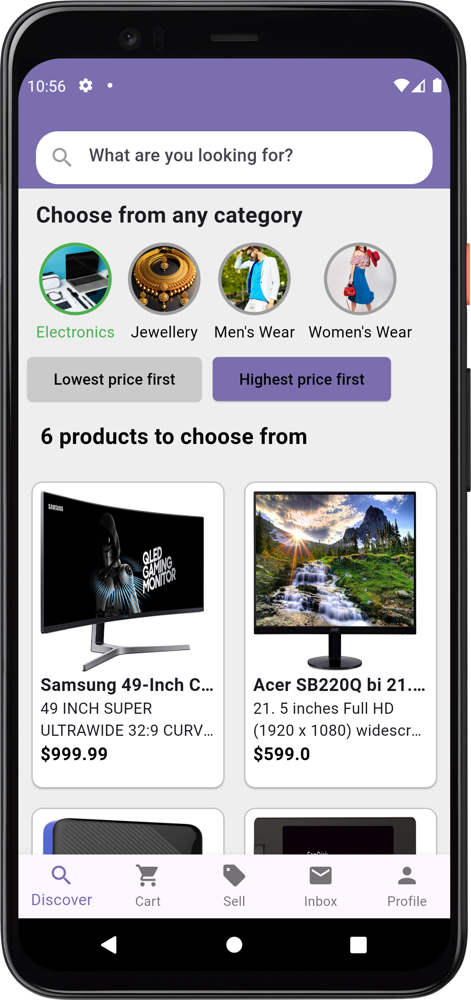
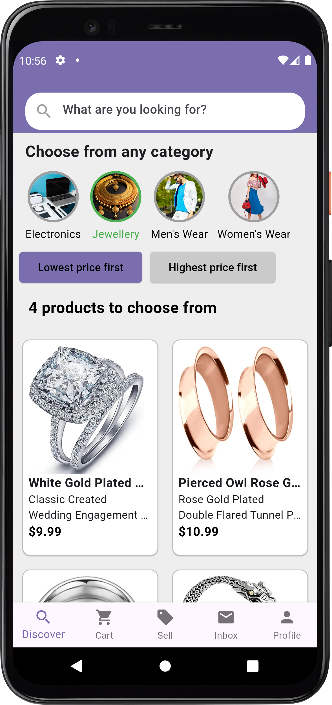
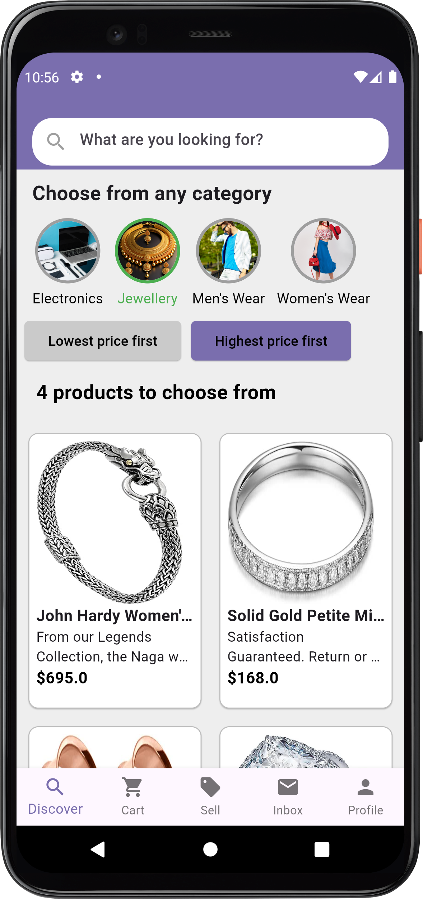
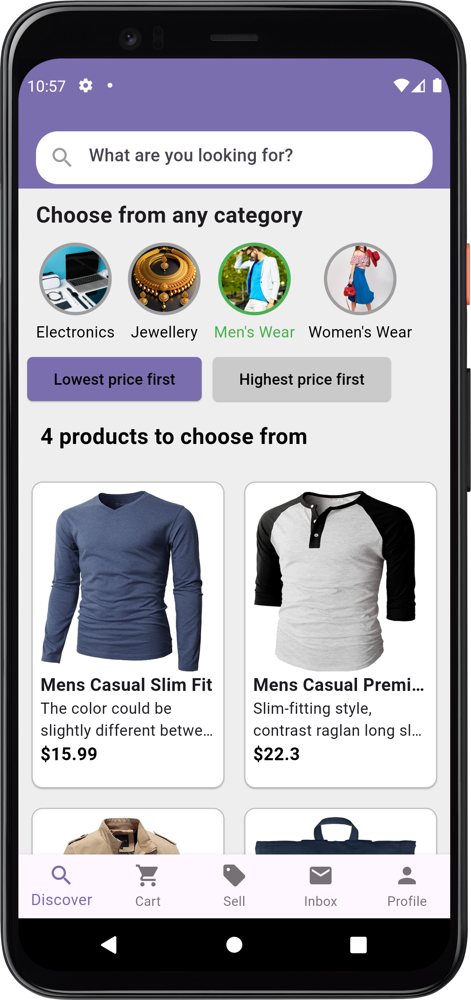
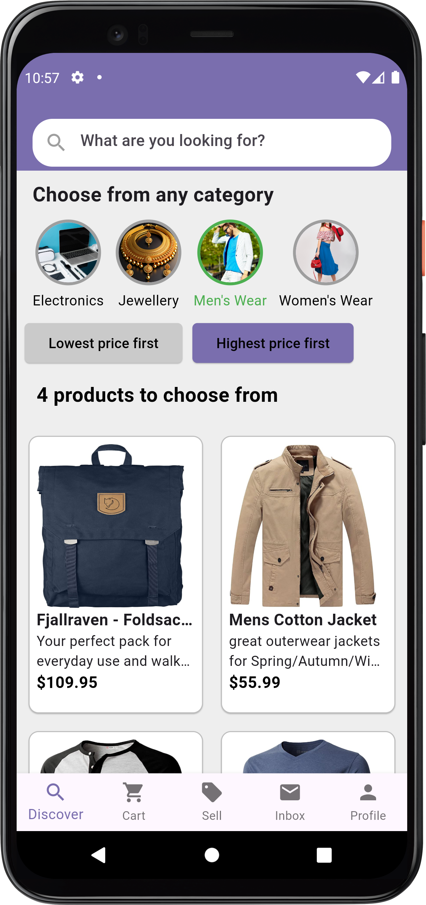
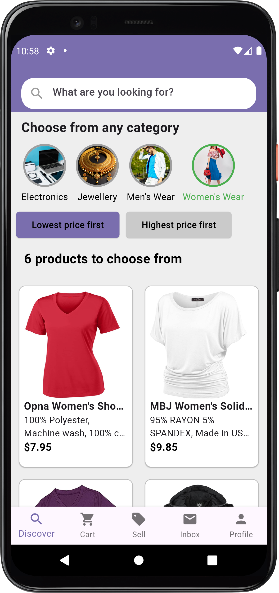
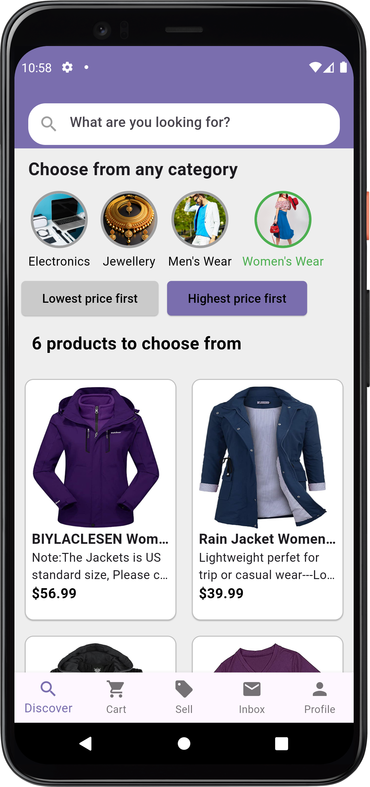

# Product Showcase App

This Flutter application displays a collection of products, allowing users to:
- Browse products across various categories.
- Filter products by category.
- Sort products by price (Lowest to Highest or Highest to Lowest).

---

## Features
1. **Category Selection**: Choose from predefined product categories.
2. **Sorting**: Sort products by price (Low to High or High to Low).
3. **Dynamic Product Count**: Displays the number of products available based on the selected category and sorting.
4. **Custom App Bar**: A reusable widget for application navigation.
5. **User-Friendly UI**: A clean and responsive layout for seamless navigation.

---

## Screenshots










---

## Installation and Setup

Follow these steps to set up and run the project locally:

1. **Clone the Repository**
   ```bash
   git clone https://github.com/Tufail-Ahmed1/Tasks-by-Patch-Technologies.git
   cd Tasks-by-Patch-Technologies
   ```

2. **Install Dependencies**
   Ensure Flutter and Dart are installed on your system. Run:
   ```bash
   flutter pub get
   ```

3. **Run the App**
   Use the following command to run the app on a connected device or emulator:
   ```bash
   flutter run
   ```

---

## Dependencies
The following packages are used in this project:
- **http**: For API calls.
- **flutter/material.dart**: For building UI components.
---

## API Integration
This app fetches product data using a placeholder API.

---

## License
This project is licensed under the MIT License.

---

## Contact
For any questions or feedback, contact me at: `tufailmallah39@gmail.com`. 
